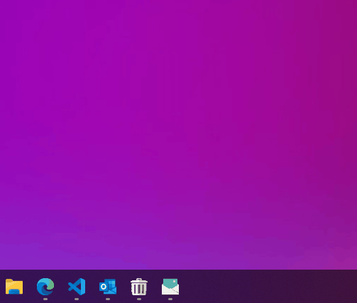
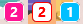
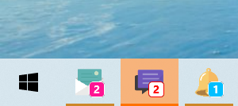
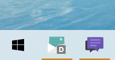
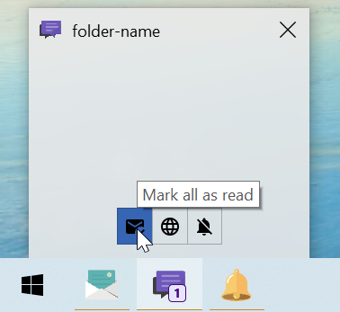
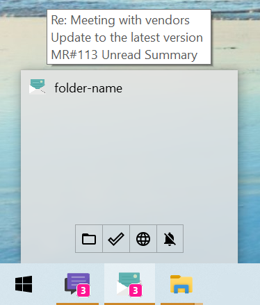

<div align="center">

# Outlook Taskbar Notifier

[](https://github.com/mdgrs-mei/outlook-taskbar-notifier/blob/main/LICENSE)
[](https://github.com/mdgrs-mei/outlook-taskbar-notifier/releases/latest)
[](https://github.com/mdgrs-mei/outlook-taskbar-notifier/releases/latest)

[](https://dev.to/mdgrsmei/how-i-customized-outlook-notifications-with-powershell-4pag)

Outlook Taskbar Notifier is a Windows taskbar application that notifies you of unread emails in an Outlook folder by showing an overlay badge.



</div>

Compared to Outlook's default desktop notifications you are less likely to miss unread emails even after leaving your seat. If you use folders to receive notifications from some web services (Jira, GitHub, GitLab etc.) you can make a dedicated notifier for each, assign the icons you like and add thumb buttons to quickly access the sites. They will work like small desktop apps for the services.

## Features
- Notifies unread email count for an Outlook folder
- Customizable icons and badge colors
- Customizable actions performed when the notifier is clicked
- Thumb buttons with customizable actions

## Requirements
- Tested on Windows 10/11 and Powershell 5.1
- Outlook desktop app needs to be installed

## Installation
1. Download and extract the [zip](https://github.com/mdgrs-mei/outlook-taskbar-notifier/releases/latest/download/outlook-taskbar-notifier.zip) or clone this repository anywhere you like
1. Copy and edit `settings.ps1` (See [Settings](#Settings))
1. Run [`tools/create_shortcut.bat`](#toolscreate_shortcutbat) and save the shortcut
1. Run the shortcut

# Settings
You can customize the behavior by a settings file. A sample settings file is placed at [sample/settings.ps1](./sample/settings.ps1).

## Outlook settings

```powershell
outlook = @{
    folderPath = "\\your-email-address@sample.com\folder-name"
}
```
`folderPath` is a path of the outlook folder that the notifier monitors. You can list all your folder paths by running [`tools/list_outlook_folders.bat`](#toolslist_outlook_foldersbat).

## Icon image

```powershell
iconPath = ".\icon.png"
```
An icon file used for the title bar. The image is converted to `.ico` file during the shortcut creation and also used as a shortcut icon. `.bmp`, `.png`, `.tif`, `.gif` and `.jpg` with single resolution are supported.

## Overlay icon


``` powershell
overlayIcon = @{
    size = 20.0
    lineWidth = 1.0
    backgroundColor = "DeepPink"
    textColor = "White"
}
```

You can change the unread badge size and color. Available WPF color names are listed here:
https://docs.microsoft.com/en-us/dotnet/api/system.windows.media.colors?view=net-5.0

If you want to hide the unread number, set `textColor` to `"Transparent"`.

## Taskbar icon flashing


``` powershell
flashTaskbar = @{
    enable = $true
    rateInMillisecond = 300
    count = 2
}
```
You can change the flash rate and count or you can completely disable this feature.

## Do Not Disturb



``` powershell
doNotDisturb = @{
    globalMode = $true
}
```

Do Not Disturb mode can be turned on by `ToggleDoNotDisturb` click [action](#actions). In Do Not Disturb mode, unread count update and icon flashing are paused and it's indicated by `"D"` badge. If `globalMode` is `$true`, Do Not Disturb status is shared between all the notifier instances. If `globalMode` is `$false`, the notifier ignores the global Do Not Disturb status and you can control it independently. 

## Click actions

``` powershell
clickActions = @(
    ,@("FocusOnFolder")
)
```

When the notifier is clicked, actions you specify here are executed sequentially. If an action fails, the subsequent actions will not be executed.

### Actions
|Action Name|Description|When does it succeed?|
|---|---|---|
|FocusOnFolder|Opens the Outlook folder that the notifier is monitoring.|Always.|
|OpenNewestUnread|Opens the newest unread email.|When the mail is opened.|
|OpenOldestUnread|Opens the oldest unread email.|When the mail is opened.|
|OpenUnreadIfOnlyOne|Opens an unread email if there is only one.|When the unread count is 1 and the mail is opened.|
|MarkAllAsRead|Marks all emails in the folder as read.|Always.|
|ToggleDoNotDisturb|Toggles [Do Not Disturb mode](#do-not-disturb).|Always.|
|FocusOnApp|Focuses on the specified app window. An app name is specified by an argument which is a process name that Get-Process PowerShell command returns. Normally it's an executable file name without `".exe"` (e.g. `"outlook"`, `"chrome"`, `"firefox"`).|When the app exists.|
|SendKeysToAppInFocus|Sends keyboard inputs to the app in focus. The key string format follows Windows.Forms.SendKeys format: https://docs.microsoft.com/en-us/dotnet/api/system.windows.forms.sendkeys?view=net-5.0|Always.|
|SleepMilliseconds|Waits for specified milliseconds to tweak the timing for SendKeys.|Always.|
|RunCommand|Runs any executable with arguments.|Always.|
|RunCommandAndWait|Runs any executable with arguments and waits until the process finishes.|Always.|
|Or|Executes actions specified as arguments sequentially and returns when an action succeeds.|When one of the actions succeeds.|

### More complex examples
1. Marks all as read and opens a web page. Recommended for web services that have notifications pages but don't support desktop notifications.

    ``` powershell
    # Opens GitHub notifications page.
    clickActions = @(
        ,@("MarkAllAsRead")
        ,@("RunCommand", '"C:\Program Files\Mozilla Firefox\firefox.exe"', "-url", "https://github.com/notifications")
    )
    ```

1. Marks all as read and sends keys to an app. Recommended for services that have shortcut commands to their notifications page.

    ``` powershell
    # Opens GitHub notifications page by sending shortcut keys to a pinned tab in Chrome.
    clickActions = @(
        ,@("MarkAllAsRead")
        ,@("FocusOnApp", "chrome")
        ,@("SendKeysToAppInFocus", "^1")
        ,@("SleepMilliseconds", 100)
        ,@("SendKeysToAppInFocus", "gn")
    )
    ```

1. Opens an unread mail if there is only one. Otherwise opens the folder.
    ``` powershell
    clickActions = @(
        ,@("Or", @("OpenUnreadIfOnlyOne"), @("FocusOnFolder"))
    )
    ```

## Thumb buttons



``` powershell
thumbButtons = @(
    ,@{
        description = "Mark all as read"
        iconPath = ".\mark_read.png"
        clickActions = @(
            ,@("MarkAllAsRead")
        )
    }
)
```
You can add maximum 7 thumb buttons and define actions performed when they are clicked. The formats of `iconPath` and `clickActions` are the same as before.

## Unread items summary



``` powershell
unreadItemsSummary = @{
    enable = $true
    maxItemCount = 10
    maxItemCharacterCount = 32
}
```

Titles of unread emails are displayed on top of the thumbnail window.

# Tools

## [tools/list_outlook_folders.bat](./tools/list_outlook_folders.bat)

Lists all the Outlook folder paths that the notifier can monitor. Copy one of the folder paths and paste it in your settings file.

## [tools/create_shortcut.bat](./tools/create_shortcut.bat)

This tool takes a settings file and creates a shortcut to run the notifier. If you want to create another notifier that monitors another Outlook folder, you just need to create a settings file and run this tool again.

## [tools/convert_image_to_ico.bat](./tools/convert_image_to_ico.bat)

Converts an image to `.ico` file. When you want to update the icon of the shortcut, run this tool.

# Sample Icons

The sample icons except [icon.png](./sample/icons/icon.png) were downloaded from [Google Material Icons](https://fonts.google.com/icons) which are distributed under [Apache License, Version 2.0](https://www.apache.org/licenses/LICENSE-2.0.html).
